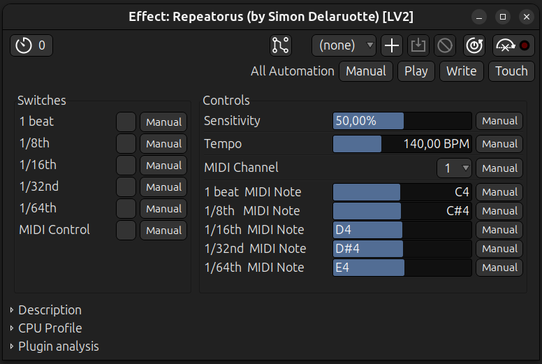

# Repeatorus LV2 Plugin

LV2 stutter effect with tempo-synced durations. Trigger via UI or MIDI notes.

 
*Plugin controls as displayed by Ardour's default generic UI. Your host may show controls differently.*

## Features

- Five independent stutter durations. Real-time capture. Tempo-synced durations : whole to sixteenth notes.
- Input sensitivity threshold for trigger detection.
- Toggle between UI and MIDI trigger modes.
- Selectable MIDI channel and assignable MIDI notes per slice.
- Stereo input/output.
- No custom GUI. Host-native controls only.
- No external dependencies. LV2 SDK only.

## Project Home

<https://simdott.github.io/repeatorus>

## Plugin URI

`urn:simdott:repeatorus`

## Dependencies

- C compiler (gcc, clang, etc.)
- LV2 development headers

**Debian/Ubuntu :**
sudo apt-get install build-essential lv2-dev

**Fedora :**
sudo dnf install gcc lv2-devel

**Arch :** 
sudo pacman -S base-devel lv2

## Installation

Using git :
1. Open a terminal (Ctrl+Alt+T)
2. `git clone https://github.com/simdott/repeatorus`
3. `cd repeatorus`
4. `sh install.sh` for user installation (recommended), or `sudo sh install.sh` for system-wide installation

Manual download :
1. Download `repeatorus.tar.gz` from https://github.com/simdott/repeatorus/releases/tag/v1.0.0
2. Extract archive
3. Open terminal in extracted folder (Right Click in folder and "Open in a terminal")
4. `sh install.sh` for user installation (recommended), or `sudo sh install.sh` for system-wide installation

## Verification

List installed plugins :
lv2ls | grep repeatorus

Should show : `urn:simdott:repeatorus`

## Usage

Load in any LV2-compatible host (Ardour, Carla, Reaper, etc.). Connect stereo inputs/outputs.

**Interface:** This plugin has no custom graphical interface. It uses your host's standard control UI (sliders, knobs, buttons, and numerical entry).

## Controls

### Main Controls

| Control | Values | Default | Description |
|---------|-------|---------|-------------|
| **Sensitivity** | 0-100% | 50% | 0% = only loudest peaks trigger loops, 100% = very quiet sounds trigger |
| **Tempo** | 60-300 BPM | 120 BPM | Base tempo for slice length calculations |

### UI Trigger Controls

| Control | Values | Description |
|---------|-------|-------------|
| **1 beat** | Off/On | Enable/disable whole-note stutter |
| **1/8th** | Off/On | Enable/disable half-note stutter |
| **1/16th** | Off/On | Enable/disable quarter-note stutter |
| **1/32nd** | Off/On | Enable/disable eighth-note stutter |
| **1/64th** | Off/On | Enable/disable sixteenth-note stutter |

### MIDI Controls

| Control | Values | Default | Description |
|---------|-------|---------|-------------|
| **MIDI Control** | 0/1 | 0 | 0 = use UI buttons, 1 = use MIDI notes |
| **MIDI Channel** | 1-16 | 1 | MIDI channel for note control |
| **1 beat MIDI Note** | 0-127 | 60 (C3) | MIDI note for whole-note stutter |
| **1/8th MIDI Note** | 0-127 | 61 (C#3) | MIDI note for half-note stutter |
| **1/16th MIDI Note** | 0-127 | 62 (D3) | MIDI note for quarter-note stutter |
| **1/32nd MIDI Note** | 0-127 | 63 (D#3) | MIDI note for eighth-note stutter |
| **1/64th MIDI Note** | 0-127 | 64 (E3) | MIDI note for sixteenth-note stutter |

### Basic Operation

1. Set **Tempo** to match your project tempo.
2. Adjust **Sensitivity** to determine how easily input triggers loops.
3. Enable desired loop stages using the **1 beat** through **1/64th** buttons.

### MIDI Control Mode

1. Enable **MIDI Control**.
2. Select **MIDI Channel**.
3. Assign MIDI notes per duration.
4. Send notes to toggle stutter patterns.

Note: MIDI Control disables UI triggers.

## Files

- repeatorus.c - Plugin source code
- repeatorus.ttl - Plugin description (ports, properties)
- manifest.ttl - Bundle manifest
- install.sh - Build and install script
- uninstall.sh - Uninstall script

## Uninstallation

**If source folder still exists** :
1. Open a terminal, then `cd /path/to/repeatorus`
2. `sh uninstall.sh` for user, or `sudo sh uninstall.sh` for system-wide

**If source folder deleted** :
1. Open a terminal
2. `rm -rf ~/.lv2/repeatorus.lv2` for user, or `sudo rm -rf /usr/lib/lv2/repeatorus.lv2`' for system-wide

### v1.0.0 (2026-03-15)

- Initial release 

## License

GPL-2.0-or-later

## Author

Simon Delaruotte (simdott)

